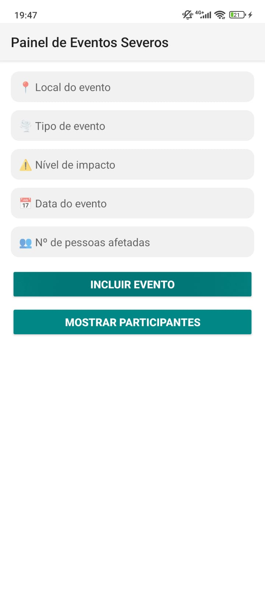
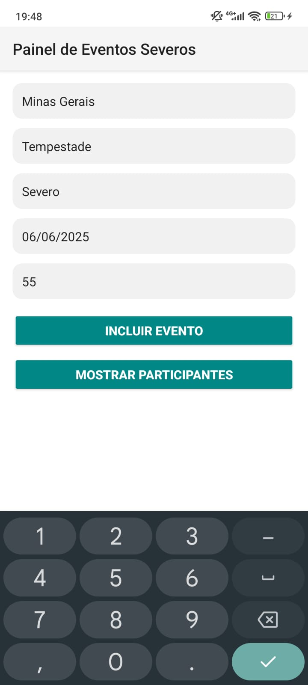
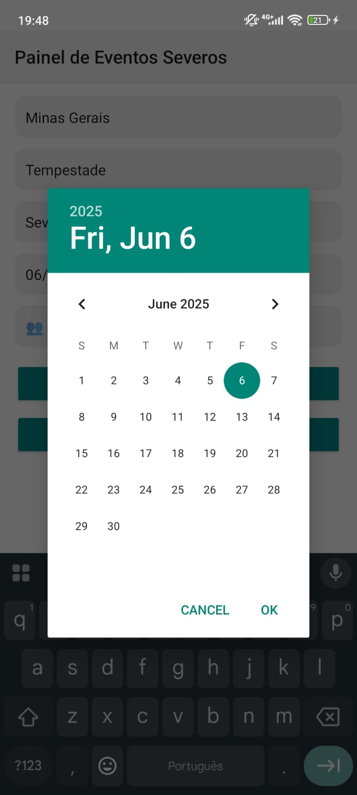
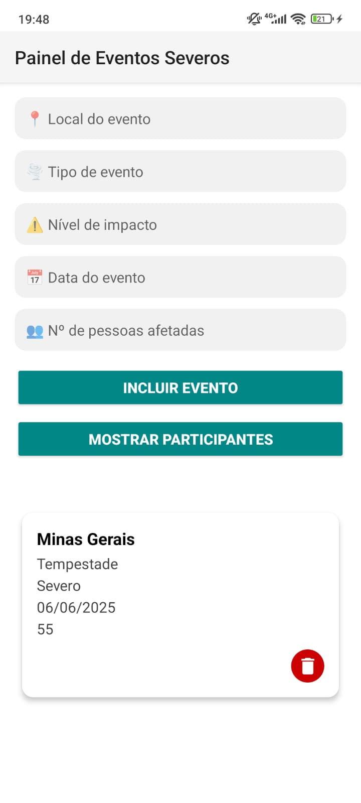
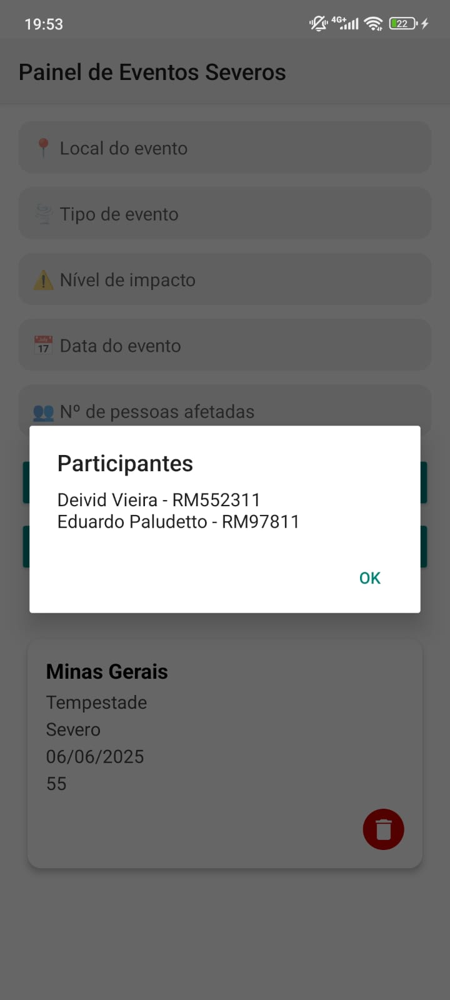

# Painel de Eventos Severos
## GS Kotlin

**Turma**: 3SIS  
**Professor**: Ewerton Carreiras  
**Tema**: Eventos Extremos

**Alunos**:
- Deivid Vieira -> RM552311
- Eduardo Paludetto Junior -> RM97811

---

## 🎯 Objetivo
Aplicativo Android que permite cadastrar e exibir eventos extremos em diferentes regiões. Foi desenvolvido em Kotlin com RecyclerView e layout customizado, conforme os requisitos da GS.

---

## ⚙️ Funcionalidades Implementadas
✅ Tela principal com 5 campos de entrada:
- Nome do local
- Tipo do evento extremo (chuva intensa, seca, onda de calor etc.)
- Grau de impacto (leve, moderado, severo)
- Data do evento
- Número estimado de pessoas afetadas

✅ Botão “Incluir” para adicionar evento no RecyclerView.  
✅ RecyclerView exibindo todos os dados inseridos, com layout customizado.  
✅ Botão “Excluir” em cada item do RecyclerView, para remoção individual.  
✅ Validação dos campos obrigatórios:
- Nenhum campo pode estar vazio.
- Número de pessoas afetadas deve ser maior que zero.

✅ Título criativo no topo: “Painel de Eventos Severos”.  
✅ Tela adicional de identificação dos participantes.
---

## 📷 Demonstração

<h3>Tela principal:</h3>

  

<h3>Preenchendo dados:</h3>

  

<h3>Preenchendo data:</h3>

  

<h3>Dados Preenchidos:</h3>

  

<h3>Tela de identificação dos participantes:</h3>

  

---

## 💡 Funcionalidades extras (Bônus)

- Salvar e recuperar dados em banco local
- Seleção da data pelo calendário
---

## 🚀 Como executar
1. Clone o projeto no Android Studio.
2. Abra o projeto e aguarde o carregamento.
3. Rode o app em um emulador ou dispositivo físico.
4. Teste as funcionalidades!

---

**Observações**:
- Projeto desenvolvido durante a GS1 2025 – prova presencial, seguindo todas as regras de originalidade.
- Todos os prints e evidências de funcionamento estão incluídos neste repositório e no arquivo `.zip` enviado para o professor.  

